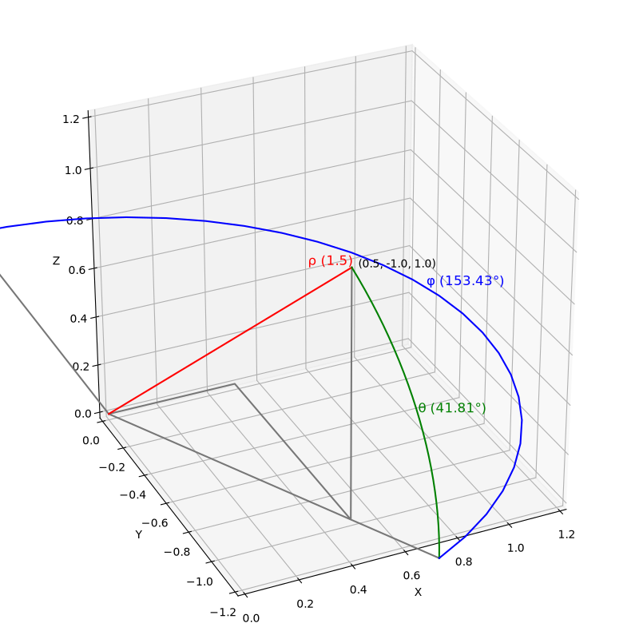
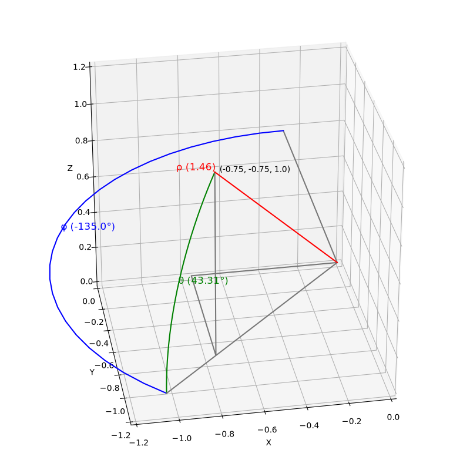

# Astronautica
"Real-time" spacecraft game, played via SSH, currently primarily in the **structure** phase.

In actuality, it will be turn-based, with all players taking simultaneous turns, but with turns at strict intervals in real time. Missing a turn is not necessarily a problem as most turns will not require action.

A Host instance must run separately from the Client instances that connect to the Host. The Host will manage the game world and control turns ticking over~~, as well as AI crewmembers~~.

Client instances will connect to the Host of a game session, and give directions to their vessel. The directions will be added to a List, and executed in order at the next game tick.

### Coordinates

Any entity in space has a local frame of reference, an object of the "Coordinates" class which tracks:
- **Position**, as a Vector3 measured from the Origin of the universal frame of reference
- **Velocity**, as a Vector3 measuring the change in Position over one second
- **Heading**, as a [Quaternion](https://en.wikipedia.org/wiki/Quaternions_and_spatial_rotation) representing current angular orientation relative to the universal frame of reference
- **Rotation**, as a Unit Quaternion representing the angular velocity, measuring the change in Heading over one second

A frame of reference can be measured from the perspective of another. This returns a **new** Coordinates object representing the properties the entity would have, if the "viewing" frame of reference were the one defining the coordinates.

Absolute Positions and Velocities are stored in NumPy Arrays as Cartesian Vectors. Coordinate Instances find and manipulate the correct values in the Master Arrays, rather than actually storing the numbers.

---

The following table details the system of Spherical Coordinates used to represent relative positions. From [Wikipedia](https://en.wikipedia.org/wiki/Spherical_coordinate_system#Conventions) (slightly clipped):

coordinates|corresponding local geographical directions (Z, X, Y)|right/left-handed
---:|:---:|---
(*r*, *θ* elevation, *φ* azimuth,right)|(U, N, E)|left
| |`Note: easting (E), northing (N), upwardness (U). Local azimuth angle would be measured, e.g., counterclockwise from S to E in the case of (U, S, E).`

This pre-existing coordinate system has been chosen because:
1. An angle where *φ*=0 is straight ahead.
2. Positive values of *φ* increase clockwise.
3. An angle where *θ*=0 is on a flat plane.
4. UNE could be the United Nations of Earth.

However, I have swapped *X* and *Y*, for a final right-handed system of **(*r*, *θ*el, *φ*az-R) : (U, E, N),** because I feel that it is probably more intuitive to an average player to envision a top-down view the same as a traditional two-dimensional graph; That is, with a horizontal *X*-axis, and a vertical *Y*-axis. This system is illustrated in the following image:

The Cartesian Point `(1, 1, 1)` is represented, therefore, by the Spherical Point `(1.73, 35.26, 45)`:
- The length of the Vector is used for *r*, or Rho (*ρ*).
- Theta (*θ*) is measured as the Degrees "up" from the horizontal plane of the viewer. It may range from `-90` to `90`, with negative values indicating "down".
- Phi (*φ*) indicates the Degrees East of North; In other words, with `0` as the *Y*-axis, looking North, an increase in Phi would indicate turning to the "right", towards East. It may range from `-180` to `180`, with negative values indicating "left".

The following two images provide examples of Coordinates outside of the first Quadrant.

